# 🌐 Web Analytics & Conversion Funnel Analysis Dashboard | Python, GA4 & Power BI

<p align="center">
  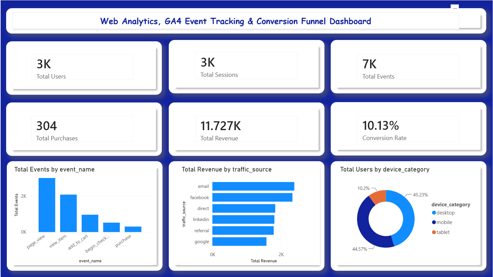
</p>

<p align="center">


</p>

---

# 📌 Project Overview

Modern businesses rely heavily on website analytics to understand customer behavior, evaluate marketing performance, and optimize digital experiences.

This project demonstrates an end-to-end web analytics solution that simulates Google Analytics 4 (GA4) event tracking data, processes and analyzes user interactions with Python, and presents business insights through an interactive Power BI dashboard.

The analysis focuses on understanding how users navigate through a website, identifying where potential customers abandon the conversion process, evaluating marketing channel performance, and providing actionable recommendations for improving conversion rates and business performance.

---

# 🎯 Business Problem

Organizations invest significant resources in attracting website visitors, yet many struggle to answer critical business questions such as:

- Why do visitors leave before converting?
- Which marketing channels generate the highest-quality traffic?
- Which devices deliver the best conversion performance?
- Which pages lose the most potential customers?
- Where do users abandon the purchase journey?
- How can website performance be optimized to increase conversions?

Without understanding these user behaviors, businesses risk losing valuable customers, reducing marketing effectiveness, and limiting revenue growth.

This project addresses these challenges using web analytics, event tracking, and conversion funnel analysis.

---

# 🎯 Project Objectives

The primary objectives of this project are to:

- Simulate realistic Google Analytics 4 (GA4) event data.
- Analyze user interactions across the website.
- Track customer journeys through the conversion funnel.
- Identify the stages with the highest user drop-off.
- Evaluate the performance of different traffic acquisition channels.
- Analyze website usage across device categories.
- Assess geographical distribution of website users.
- Build an interactive Power BI dashboard for business stakeholders.
- Generate actionable recommendations to improve website conversion performance.

---

# 📈 Business Questions

This project seeks to answer the following business questions:

1. How many users visit the website?
2. Which website events occur most frequently?
3. Which traffic sources generate the highest conversion rates?
4. Which device categories contribute most to conversions?
5. Which countries generate the highest-performing users?
6. Where do users abandon the conversion funnel?
7. Which landing pages attract the most traffic?
8. Which business actions could improve conversion performance?

---

# 🛠 Technologies Used

| Category | Technology |
|-----------|------------|
| Programming Language | Python |
| Data Processing | Pandas |
| Numerical Computing | NumPy |
| Visualization | Matplotlib |
| Dashboard Development | Power BI |
| Web Analytics | Google Analytics 4 (GA4) Concepts |
| Data Storage | CSV Files |
| Development Environment | Jupyter Notebook |

---

# 📂 Repository Structure

```text
Web-Analytics-GA4-Conversion-Funnel-Dashboard/
│
├── README.md
├── web_analytics_ga4_funnel_analysis.py
├── Web_Analytics_GA4_Funnel_Analysis.ipynb
│
├── data/
│   ├── scraped_products.csv
│   ├── ga4_event_data.csv
│   └── ga4_cleaned_event_data.csv
│
├── images/
│   ├── project_banner.png
│   ├── executive_dashboard.png
│   ├── conversion_funnel_dashboard.png
│   ├── acquisition_dashboard.png
│   ├── device_dashboard.png
│   ├── geography_dashboard.png
│   ├── landing_page_dashboard.png
│   ├── event_distribution.png
│   ├── conversion_funnel.png
│   ├── conversion_rate_by_device.png
│   ├── conversion_rate_by_country.png
│   ├── conversion_rate_by_traffic_source.png
│   ├── dropoff_rate_by_stage.png
│   └── revenue_by_traffic_source.png
│
├── outputs/
│   ├── cleaned_ga4_event_data.csv
│   ├── conversion_funnel_summary.csv
│   ├── country_summary.csv
│   ├── device_summary.csv
│   ├── kpi_summary.csv
│   ├── landing_page_summary.csv
│   ├── traffic_source_summary.csv
│   └── business_recommendations.txt
│
└── requirements.txt
```

---

# 📊 Project Workflow

```text
Website Data
        │
        ▼
Data Collection
(Web Scraping + Simulated GA4 Events)
        │
        ▼
Data Cleaning & Transformation
        │
        ▼
Feature Engineering
        │
        ▼
Exploratory Data Analysis (EDA)
        │
        ▼
KPI Calculation
        │
        ▼
Conversion Funnel Analysis
        │
        ▼
Traffic Source Analysis
        │
        ▼
Device & Geography Analysis
        │
        ▼
Power BI Dashboard Development
        │
        ▼
Business Insights & Recommendations
```

---

# 🎯 Expected Business Value

This project demonstrates how web analytics can help organizations:

- Improve customer conversion rates.
- Identify friction points in the customer journey.
- Evaluate digital marketing performance.
- Optimize website user experience.
- Reduce customer abandonment.
- Support data-driven business decisions.
- Maximize marketing return on investment (ROI).

---

# 📂 Dataset Description

Unlike traditional analytics projects that rely on historical website logs, this project combines **real web data collection** with **simulated Google Analytics 4 (GA4) event tracking** to recreate a realistic website analytics environment.

The objective is to demonstrate an end-to-end web analytics workflow similar to those used by Digital Analysts and Product Analysts in production environments.

The project dataset consists of two major components:

1. Product metadata collected from an online website through web scraping.
2. Simulated GA4-style website event data representing user interactions across a conversion funnel.

---

# 🌍 Data Collection

## Step 1 – Web Scraping

The first stage of the project involved collecting publicly available product information from an online e-commerce website using Python.

The following libraries were used:

- Requests
- BeautifulSoup
- Pandas

The scraped information included:

- Product Name
- Product Price
- Product Availability

Example output:

| Product | Price | Availability |
|----------|------:|-------------|
| Data Analytics Handbook | £32.50 | In Stock |
| Python Fundamentals | £24.90 | In Stock |
| Business Intelligence Guide | £39.95 | In Stock |

This product information was later used to generate realistic purchase events within the simulated website.

---

## Step 2 – Simulated Google Analytics 4 (GA4) Event Data

Because access to production GA4 data is typically restricted, a realistic event-level dataset was generated to emulate the structure of Google Analytics 4 exports.

Each record represents a user interaction (event) occurring during a website session.

Examples include:

- page_view
- view_item
- add_to_cart
- begin_checkout
- purchase

This approach enables the analysis of user behavior, customer journeys, and conversion funnels using realistic analytics data.

---

# 🗂 Dataset Structure

The final event dataset contains the following fields:

| Column | Description |
|---------|-------------|
| user_id | Unique visitor identifier |
| session_id | Unique browsing session |
| event_timestamp | Date and time of event |
| event_date | Event date |
| event_hour | Hour of occurrence |
| event_name | Website interaction performed |
| page_title | Page viewed by the visitor |
| page_location | Website URL or page path |
| traffic_source | Acquisition channel |
| medium | Marketing medium |
| device_category | Desktop, Mobile or Tablet |
| country | Visitor location |
| product_name | Product involved |
| event_value | Purchase value (if applicable) |

---

# 📌 Event Tracking

The project simulates the most common Google Analytics 4 events.

| Event | Business Meaning |
|--------|------------------|
| page_view | User visits a webpage |
| view_item | User views a product |
| add_to_cart | User adds a product to cart |
| begin_checkout | User begins checkout |
| purchase | User completes purchase |

Tracking these events allows businesses to evaluate customer engagement and identify where visitors abandon the purchase journey.

---

# 🧹 Data Cleaning

High-quality analytics depends on clean and reliable data.

Several preprocessing steps were performed before analysis.

## Missing Values

Missing numerical values were identified and replaced where appropriate.

```python
df["event_value"] = (
    pd.to_numeric(df["event_value"], errors="coerce")
      .fillna(0)
)
```

---

## Duplicate Records

Duplicate website events were removed to prevent inflated KPI calculations.

```python
df.drop_duplicates(inplace=True)
```

---

## Date Conversion

Timestamp fields were converted into proper datetime format.

```python
df["event_timestamp"] = pd.to_datetime(df["event_timestamp"])
```

Additional date features were extracted.

```python
df["event_date"] = df["event_timestamp"].dt.date
df["event_hour"] = df["event_timestamp"].dt.hour
```

These fields support trend analysis and time-based reporting.

---

# ⚙ Feature Engineering

Additional analytical features were created to improve business reporting.

Examples include:

- Event Date
- Event Hour
- Conversion Funnel Stage
- Revenue
- Session-Level Metrics

These engineered variables make it easier to calculate KPIs and visualize user journeys.

---

# 📊 Key Performance Indicators (KPIs)

The following business metrics were calculated throughout the project.

---

## Total Users

Represents the number of unique visitors.

```python
total_users = df["user_id"].nunique()
```

---

## Total Sessions

Represents the number of browsing sessions.

```python
total_sessions = df["session_id"].nunique()
```

---

## Total Events

Measures the total number of recorded website interactions.

```python
total_events = len(df)
```

---

## Total Purchases

Counts completed purchases.

```python
total_purchases = (
    df[df["event_name"]=="purchase"]["user_id"]
      .nunique()
)
```

---

## Total Revenue

Calculates revenue generated through completed purchases.

```python
total_revenue = (
    df[df["event_name"]=="purchase"]["event_value"]
      .sum()
)
```

---

## Conversion Rate

Measures the proportion of visitors who completed a purchase.

\[
Conversion\ Rate =
\frac{Purchasing\ Users}
{Total\ Users}
\times100
\]

---

## Events per Session

Measures user engagement during each visit.

\[
Events\ per\ Session =
\frac{Total\ Events}
{Total\ Sessions}
\]

---

## Average Revenue per Purchase

Measures the average monetary value of completed transactions.

\[
Average\ Revenue\ per\ Purchase =
\frac{Total\ Revenue}
{Total\ Purchases}
\]

---

# 📉 Conversion Funnel

The project models a standard e-commerce conversion funnel.

```text
Website Visit
      │
      ▼
Page View
      │
      ▼
View Product
      │
      ▼
Add to Cart
      │
      ▼
Begin Checkout
      │
      ▼
Purchase
```

This funnel allows the identification of stages where customers abandon the purchasing process.

---

# 📊 Analytical Methodology

The project follows a structured analytics workflow.

```text
Data Collection
        │
        ▼
Data Cleaning
        │
        ▼
Feature Engineering
        │
        ▼
Exploratory Data Analysis
        │
        ▼
KPI Calculation
        │
        ▼
Conversion Funnel Analysis
        │
        ▼
Traffic Source Analysis
        │
        ▼
Device Performance Analysis
        │
        ▼
Country Analysis
        │
        ▼
Interactive Power BI Dashboard
        │
        ▼
Business Recommendations
```

---

# 🎯 Analytical Objectives

The analysis seeks to answer several important business questions:

- Which events occur most frequently?
- Where do users abandon the conversion process?
- Which traffic source generates the highest conversions?
- Which device performs best?
- Which countries produce the highest conversion rates?
- Which pages attract the most visitors?
- How can website performance be improved?

These questions guide the exploratory analysis and the development of business recommendations presented in the Power BI dashboard.

# 📊 Interactive Power BI Dashboard

After completing the data collection, preprocessing, feature engineering, and exploratory analysis in Python, the processed datasets were imported into **Power BI** to build an interactive dashboard for business stakeholders.

The dashboard was designed to support executive reporting by presenting website performance metrics, user behavior, marketing effectiveness, and conversion funnel insights in a clear and interactive format.

---

# 📑 Dashboard Pages

The report consists of five interactive pages:

1. Executive Overview
2. Conversion Funnel Analysis
3. Traffic Acquisition Analysis
4. Device & Geographic Performance
5. Landing Page Performance

Each page focuses on a different aspect of website performance while remaining fully interactive through filters and slicers.

---

# 📈 Dashboard 1 – Executive Overview

<p align="center">

</p>

## Dashboard Objectives

Provide management with a high-level overview of website performance.

### KPIs

- Total Users
- Total Sessions
- Total Website Events
- Total Purchases
- Total Revenue
- Conversion Rate
- Average Revenue per Purchase
- Events per Session

### Additional Visualizations

- Event Distribution
- Revenue by Traffic Source
- Users by Device Category

---

## Business Insight

The Executive Dashboard provides an immediate understanding of overall website performance by combining user activity, purchase behavior, and revenue metrics into a single view.

Decision makers can quickly identify whether website traffic is increasing, whether visitors are converting, and which acquisition channels contribute most to business performance.

---

# 📊 Dashboard 2 – Conversion Funnel Analysis

<p align="center">
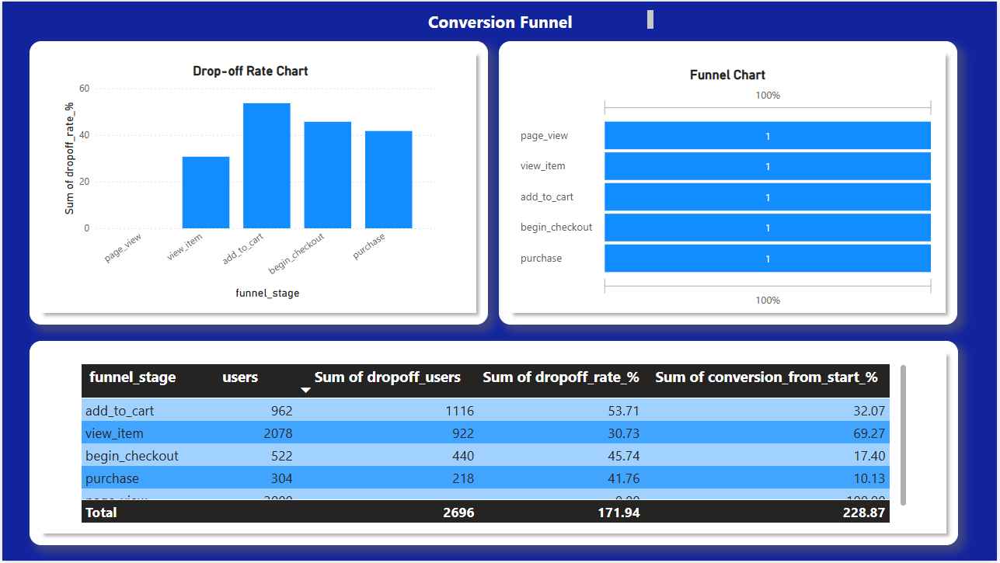
</p>

## Funnel Stages

```text
Page View
      │
      ▼
View Item
      │
      ▼
Add to Cart
      │
      ▼
Begin Checkout
      │
      ▼
Purchase
```

### Dashboard Components

- Funnel Visualization
- Funnel Stage Table
- Drop-off Rate Chart
- Conversion Rate Summary

---

## Business Insight

The funnel analysis identifies where users discontinue their purchasing journey.

Rather than simply measuring purchases, the dashboard explains **why conversions are lost** by highlighting stages with significant customer abandonment.

This information enables organizations to prioritize improvements where they can generate the greatest increase in conversions.

---

## Example Findings

- Most visitors successfully view products.
- A noticeable proportion abandon the website before adding products to the cart.
- Additional users exit during the checkout process.
- Only a percentage of visitors complete the purchase.

---

## Business Recommendations

- Simplify product pages.
- Improve checkout usability.
- Reduce unnecessary checkout steps.
- Increase trust signals during payment.
- Improve page loading performance.

---

# 🚀 Dashboard 3 – Traffic Acquisition Analysis

<p align="center">
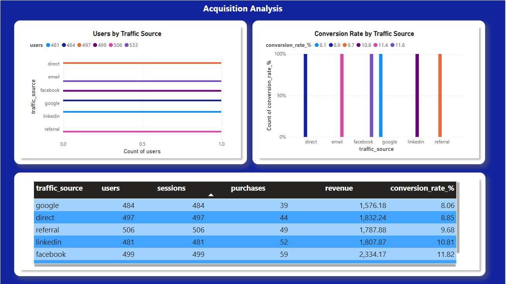
</p>

## Dashboard Components

- Users by Traffic Source
- Revenue by Traffic Source
- Conversion Rate by Traffic Source
- Traffic Source Performance Table

---

## Business Insight

Not all marketing channels generate visitors with the same purchasing intent.

Some channels deliver high traffic volumes but poor conversion rates, while others attract fewer visitors who convert at much higher rates.

This dashboard supports better marketing budget allocation.

---

## Business Recommendations

- Increase investment in high-performing channels.
- Optimize campaigns with low conversion.
- Evaluate paid advertising ROI.
- Improve audience targeting.

---

# 💻 Dashboard 4 – Device & Geographic Performance

<p align="center">
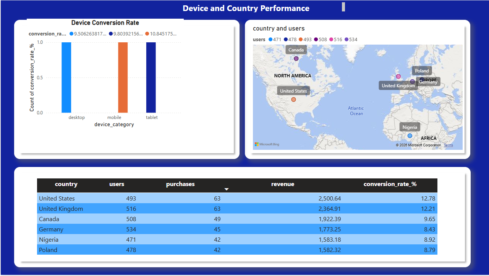
</p>

<p align="center">

</p>

---

## Device Analysis

The dashboard compares website performance across:

- Desktop
- Mobile
- Tablet

Metrics include:

- Users
- Purchases
- Revenue
- Conversion Rate

---

## Geographic Analysis

Website visitors are analyzed by country to determine:

- User distribution
- Purchase activity
- Revenue generation
- Conversion performance

---

## Business Insight

Device-level analysis helps identify whether certain platforms experience usability issues.

Country-level analysis provides insight into regional performance and supports localization strategies.

---

## Business Recommendations

- Improve mobile optimization where conversion is weak.
- Localize marketing campaigns.
- Optimize regional landing pages.
- Prioritize high-performing geographic markets.

---

# 🌍 Dashboard 5 – Landing Page Performance

<p align="center">
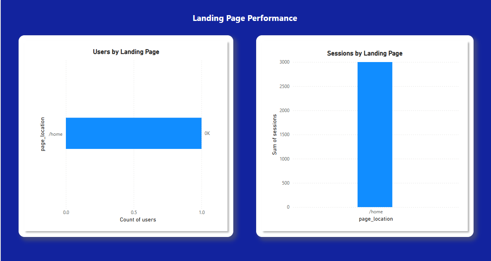
</p>

---

## Dashboard Components

- Users by Landing Page
- Sessions by Landing Page
- Landing Page Summary Table

---

## Business Insight

Landing pages serve as the first interaction between visitors and the website.

Analyzing landing page performance helps determine which pages successfully engage users and which require optimization.

---

## Business Recommendations

- Improve page content.
- Optimize page loading speed.
- Strengthen Call-To-Action (CTA) placement.
- Improve user experience.

---

# 📈 Python Visualizations

The following visualizations were produced during exploratory data analysis.

---

## Event Distribution

<p align="center">
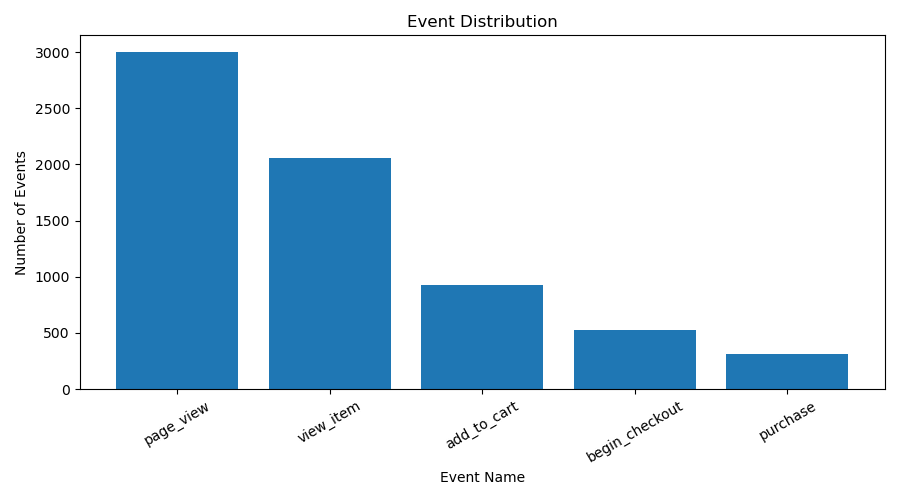
</p>

Shows the frequency of each tracked GA4 event.

---

## Conversion Funnel

<p align="center">
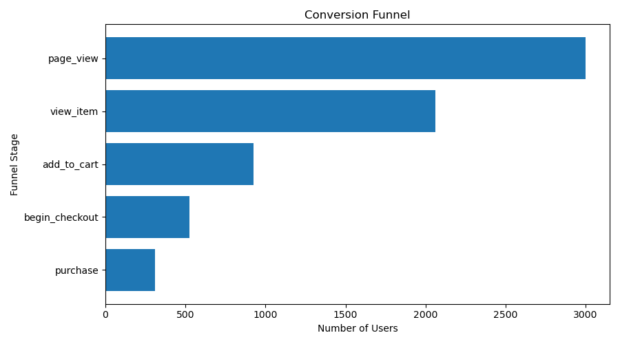
</p>

Illustrates user progression through each funnel stage.

---

## Drop-off Rate

<p align="center">
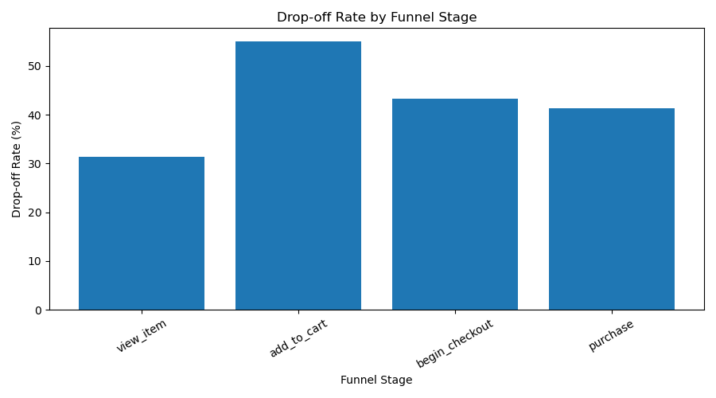
</p>

Highlights the percentage of users leaving at each stage.

---

## Conversion Rate by Traffic Source

<p align="center">
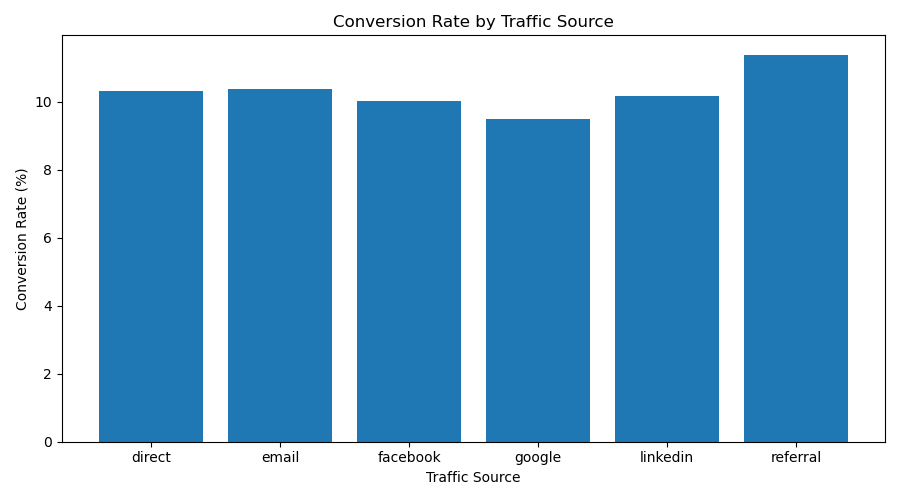
</p>

Compares marketing channel effectiveness.

---

## Revenue by Traffic Source

<p align="center">
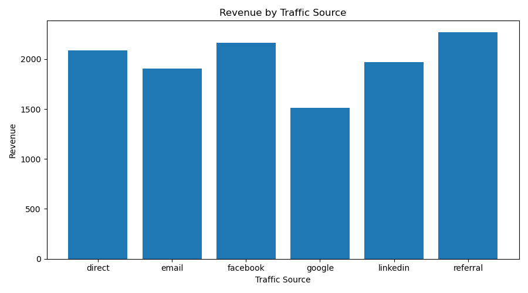
</p>

Shows the revenue generated by each acquisition channel.

---

## Conversion Rate by Device

<p align="center">
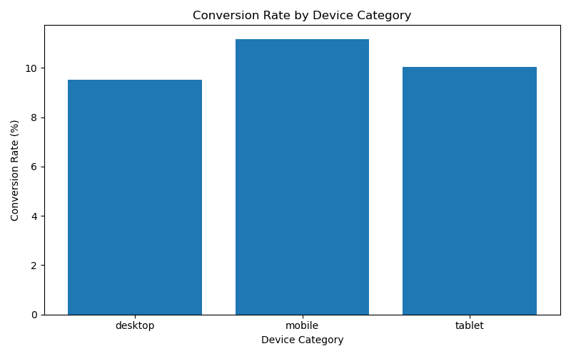
</p>

Evaluates website performance across device categories.

---

## Conversion Rate by Country

<p align="center">
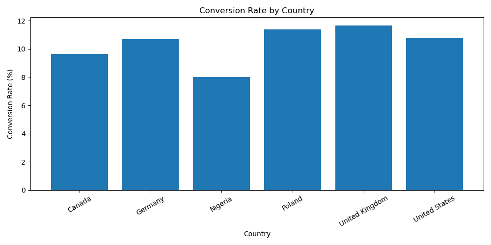
</p>

Illustrates geographic differences in website conversion.

---

# 💡 Key Business Insights

The analysis produced several important findings:

### Insight 1

Website visitors do not progress uniformly through the purchasing journey.

---

### Insight 2

Certain stages of the conversion funnel experience substantially higher user abandonment.

---

### Insight 3

Traffic quality differs considerably across acquisition channels.

---

### Insight 4

Device category influences conversion performance.

---

### Insight 5

Website performance varies across geographic regions.

---

### Insight 6

Landing page effectiveness directly influences downstream conversion rates.

---

# 📌 Executive Summary

This project demonstrates how web analytics can transform raw website events into meaningful business intelligence.

Rather than reporting website traffic alone, the analysis explains:

- How visitors behave.
- Where conversions are lost.
- Which marketing channels perform best.
- Which devices convert more effectively.
- Which geographic markets create the greatest business value.

The resulting dashboard provides decision-makers with actionable insights that support marketing optimization, customer acquisition, and conversion improvement.

---

# 💼 Strategic Business Recommendations

Based on the findings, the following actions are recommended:

## Website Optimization

- Improve page speed.
- Simplify navigation.
- Reduce checkout friction.

---

## Marketing Optimization

- Increase investment in high-performing channels.
- Improve targeting of underperforming campaigns.

---

## Conversion Optimization

- Optimize landing pages.
- Improve product descriptions.
- Strengthen call-to-action placement.

---

## Customer Experience

- Improve mobile usability.
- Personalize website content.
- Simplify purchase flows.

---


# 🚀 Skills Demonstrated

This project showcases practical skills across the entire analytics lifecycle.

## Data Collection

- Web Scraping
- HTTP Requests
- HTML Parsing
- BeautifulSoup

---

## Data Engineering

- Data Cleaning
- Data Transformation
- Feature Engineering
- Data Validation

---

## Data Analysis

- Exploratory Data Analysis (EDA)
- KPI Reporting
- Conversion Funnel Analysis
- User Journey Analysis
- Marketing Analytics
- Website Performance Analysis

---

## Data Visualization

- Python Visualizations
- Power BI Dashboards
- Executive Reporting
- Interactive Business Intelligence

---

## Business Analytics

- Customer Journey Analysis
- Traffic Source Evaluation
- Device Performance Analysis
- Geographic Performance Analysis
- Marketing Performance
- Conversion Optimization
- Decision Support

---

# 🎯 Business Value Delivered

This project demonstrates how organizations can leverage web analytics to:

- Improve conversion rates.
- Optimize digital marketing campaigns.
- Increase website engagement.
- Reduce customer abandonment.
- Identify high-performing acquisition channels.
- Improve user experience.
- Support data-driven decision-making.

---

# 📈 Future Improvements

Potential future enhancements include:

## Google Analytics 4 API

Replace the simulated event dataset with live data from the Google Analytics Data API.

---

## BigQuery Integration

Connect directly to GA4 BigQuery Export datasets for large-scale analysis.

---

## Predictive Analytics

Develop machine learning models to predict user conversions and identify visitors at high risk of abandoning the funnel.

Potential algorithms include:

- Logistic Regression
- Random Forest
- XGBoost
- Gradient Boosting
- Neural Networks

---

## Real-Time Dashboard

Build a real-time monitoring dashboard using:

- Power BI Service
- Streamlit
- Plotly Dash
- Microsoft Fabric

---

## Marketing Attribution

Expand the project to analyze:

- First-click attribution
- Last-click attribution
- Multi-touch attribution

---

# 📚 Key Learning Outcomes

This project strengthened my practical understanding of:

- Website Analytics
- Google Analytics 4 Concepts
- Event Tracking
- User Journey Analysis
- Marketing Analytics
- Funnel Optimization
- Business Intelligence
- Interactive Dashboard Design
- Data Storytelling
- Executive Reporting

---

# 👨‍💻 About the Author

## Bulus Umoru

Data Analyst | BI Analyst

I enjoy transforming raw data into meaningful business insights through analytics, visualization, and dashboard development.

My interests include:

- Data Analytics
- Business Intelligence
- Web Analytics
- Marketing Analytics
- Machine Learning
- AI
- Data Engineering

---

# 🌐 Connect With Me

## LinkedIn

https://www.linkedin.com/in/bulus-umoru/

---

## Portfolio

https://umorubulus.github.io/Portfolio/

---

## GitHub

https://github.com/umorubulus

---

# 📬 Feedback

If you have suggestions for improving this project, feel free to:

⭐ Star this repository

🐛 Open an Issue

🔧 Submit a Pull Request

💼 Connect with me on LinkedIn

Feedback and collaboration are always welcome.

---

# 🙏 Acknowledgements

Special thanks to the open-source community and the creators of:

- Python
- Pandas
- NumPy
- Matplotlib
- BeautifulSoup
- Power BI
- Google Analytics 4

for providing the tools that made this project possible.

---

# ⭐ Final Thoughts

This repository demonstrates an end-to-end analytics workflow—from data collection and preprocessing to interactive dashboard development and business insight generation.

By combining **Python**, **Google Analytics 4 concepts**, and **Power BI**, the project illustrates how digital analytics can be used to understand user behavior, evaluate marketing effectiveness, identify conversion bottlenecks, and support evidence-based business decisions.

If you found this project helpful or interesting, please consider giving it a ⭐ on GitHub and connecting with me on LinkedIn.

Happy Exploring! 🚀
